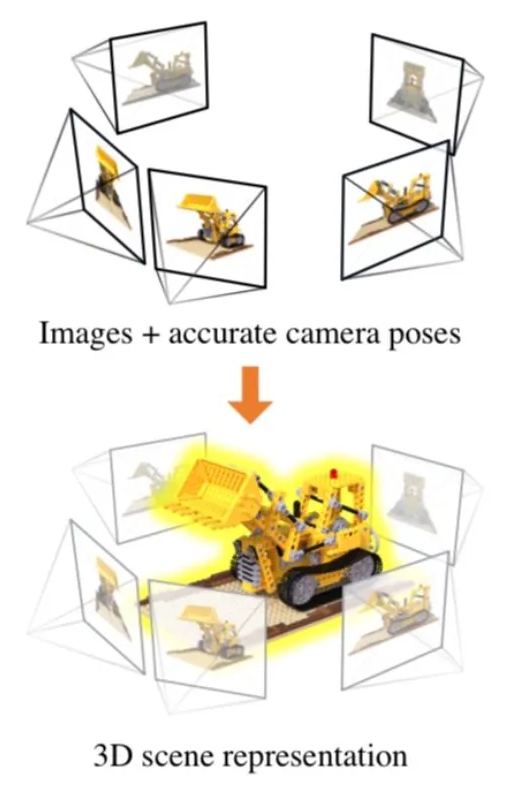
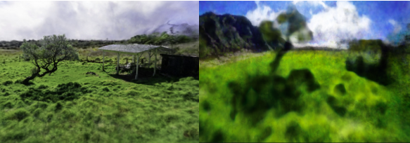
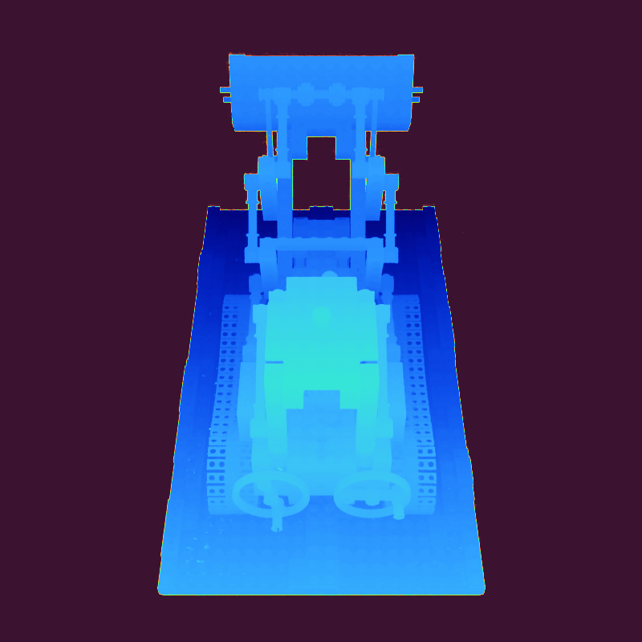
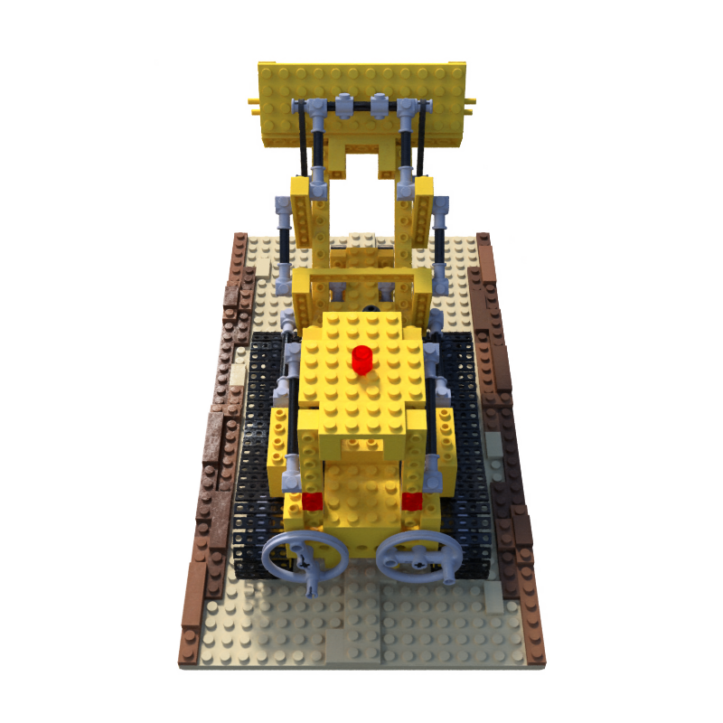

<div align="center">

# <b>Accelerate NeRF</b>

###  Real-Time High-Precision Rendering with Instant NGP and Comparative Analysis



</div>

## Introduction

Inthe exploration of the 3D modeling domain and the metaverse, there is a growing emphasis on replicating our world with a high degree of realism. In addition, some things become clearer when we see them in 3D. It’s like gaining a different viewpoint that helps us understand stuff in a new way.
The approach to digitizing real-world objects involves the application of Neural Radiance Fields (NeRFs).

The primary objective of this project is to delve into the Neural Graphics Primitives (NGP) optimization technique and other strategies to facilitate real-time performance in the Neural Radiance Field (NeRF). We aim to comprehensively understand the impact of NGP and alternative optimization methods on the training and runtime efficiency of NeRF.
<div align="center">
    


</div>

## Dataset

We have used nerf_synthetic and LLff dataset which can be downloaded from [here](https://drive.google.com/drive/folders/128yBriW1IG_3NJ5Rp7APSTZsJqdJdfc1) .


## Project milestones and Results

### Dataset Preparation:

We preprocessed the Nerf-Synthetic and LLFF datasets, ensuring compatibility with both Nerf-pytorch and Instant NGP frameworks. These datasets contain diverse scenes with varying levels of complexity, allowing us to evaluate the models' performance across different scenarios.

```bash
python ./torch-ngp/scripts/llff2nerf.py
```
You use this to convert the intrinsic data format (used by LLFF dataset) to JSON format used by most nerf models (also nerf_synthetic format).
### Training and Evaluation:
We trained both Nerf-pytorch and Instant NGP on the prepared datasets, employing standard training protocols and hyperparameters. Subsequently, we conducted thorough evaluations, including visualizations, performance profiling, and result interpretation.

The WandB page for NeRF is available [here](https://wandb.ai/vb2386/Sweep_Nerf?nw=nwuservb2386)
The WandB page for NGP is available [here](https://wandb.ai/vb2386/Sweep_NGP?nw=nwuservb2386)

### Visualizations:
We generated qualitative visualizations of the reconstructed scenes from both models to assess the quality of the reconstructions. Visual inspection allows for a comparative analysis of the models' ability to capture fine details and reproduce scene geometry accurately.

Dataset | NeRF | NGP
:-------------------------:|:-------------------------:|:-------------------------:
`LEGO (nerf_synthetic)` |  |
`Fern (LLFF)` |  |  

### Performance Profiling:
To quantify the computational efficiency and memory usage of Nerf-pytorch and Instant NGP, we conducted performance profiling experiments. These experiments provide insights into the models' scalability and resource requirements, crucial for practical deployment scenarios.

<div align="center">
    


</div>

### Lego trained weights

You can find the pre trained models for lego dataset inside results folder for each implementation as `model.pt` .
**Note**: For the scope of the project, only relevant hyperparameters are selected for sweeping.


### Additional Results

<div align="left">
    



<div align="right">
    


</div>
</div>

## Inference:


## Project Structure

| File/Directory | Description |
|----------------|-------------|
| `Images` | Images/artwork |
| `Results` | Results with model checkpoints |
| `notebooks` | Interactive notebooks for training and inference |
| `torch-ngp` | NGP training setup and scripts |
| `scripts` | SLURM batch files |
| `taichi-nerf` | taichi training setup and scripts |
| `nerf_pytorch` | NeRF training setup and scripts |


## Usage

**Note: It's highly recommended that you use a GPU.**

1. Clone the repository
    ```bash
    git clone https://github.com/VaruniBuereddy/AccelerateNerf.git
    ```
### NGP  
1. Setup and activate the virtual environment
    ```bash
    cd torch-ngp
    source venv/bin/activate
    ```
2. Install the required dependencies
    ```bash
    pip install -r requirements.txt
    ```
3. Run the training with profiling 
    ```bash
    python profile_ngp -- 
    ```
### NeRF
1. Run he training with profiling
```
python profile_nerf -- 
```
### Taichi
Alternatively, the taichi model can also be trianed  by
scheduling a batch job on an HPC cluster using `sbatch scripts/taichi_NGP.sh`.

**Note: This is recommended to be done on hpc as it is GPU extensive and similar to running CUDA kernels.**

## References
```
@article{mueller2022instant,
    author = {Thomas M\"uller and Alex Evans and Christoph Schied and Alexander Keller},
    title = {Instant Neural Graphics Primitives with a Multiresolution Hash Encoding},
    journal = {ACM Trans. Graph.},
    issue_date = {July 2022},
    volume = {41},
    number = {4},
    month = jul,
    year = {2022},
    pages = {102:1--102:15},
    articleno = {102},
    numpages = {15},
    url = {https://doi.org/10.1145/3528223.3530127},
    doi = {10.1145/3528223.3530127},
    publisher = {ACM},
    address = {New York, NY, USA},
}
```
```
@misc{torch-ngp,
    Author = {Jiaxiang Tang},
    Year = {2022},
    Note = {https://github.com/ashawkey/torch-ngp},
    Title = {Torch-ngp: a PyTorch implementation of instant-ngp}
}
```

## Authors

- Varuni Buereddy (vb2386)
- Rajesh Nagula (rgn5646)

## License

This project is licensed under MIT License. See [LICENSE](./LICENSE).
